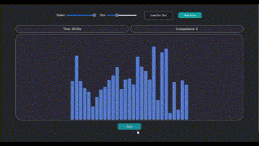
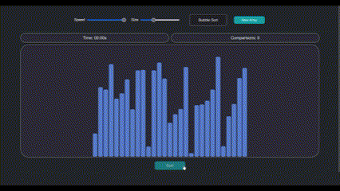
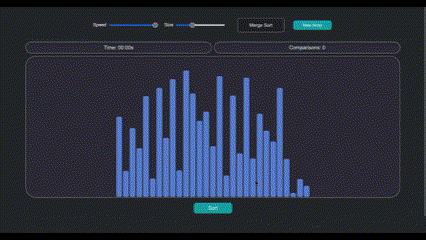
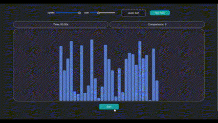
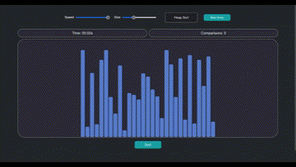

# Sorting-Visualizer
## Description
The Sorting Visualizer is exactly what it's called, with extra features added into it. It shows a live visualization of 6 different sorting algorithms, namely, Selection Sort, Insertion Sort, Bubble Sort, Merge Sort, Quick Sort, and Heap Sort. Each of these algorithms can be selected and viewed at any speed (slow or fast) on an array of any sizes between 5 and 80 (for different perspectives). Algorithms are performed on randomized arrays and have a dedicated timer and number of comparisons counter so the time taken and comparisons made by one algorithm can be compared with another for a representation of the varying time-complexities of the algorithms. 

I used HTML, CSS, and JavaScript to implement this project because of the flexibility provided by these languages when it comes to website construction. Although the languages aren't difficult to work with, I found it a challange to display the bars and manipulate them via their colors and heights to create a sorting visualization. In the coming future, I hope to implement more feature such as the ability to pick the type of array which the user would like to sort (e.g. sorted, nearly sorted, reverse sorted), which can help provide further knowledge of how certain algorithms perform under certain cases.

## Implementation
I used a group of individual bars to represent the sorting visually. For each bar, I used a div with a randomly generated height between 5 and 250 pixels. The sorting of the bars involves using asynchronous functions in JavaScript to create a delay time between operations to allow the sorting to be slowed down and sped up as wanted. The speed slider controls the delay time, which naturally affects the amount of time the full sorting takes. When bars need to be swapped, instead of swapping the individual divs, I swap the heights of the bars for a cleaner implementation. 

The algorithms are contained separately in the algorithms directory and each of them are implemented with their most efficent versions to allow for the least number of comparisons. Withtin the algorithms, I label each bar with a color coresponding to its current state in the sorting process (red - unsorted, yellow - being swapped, blue - being put in its sorted position, green - sorted). Bar heights are swapped similarily to how elements in an array are swapped when being sorted. Each time a comparison of bars is made, the comparison counter is incremented.

## Setup Requirements
- Clone project to your desktop
- Open the directory on your computer
- Open index.html on your browser

## How to Use

- Above is the preview of the main page of the website where the sorting occurs. 

- Before clicking sort, you can customize the speed of the sorting and size of the array using their respective sliders.

- The sorting algorithm which you want to visualize can be chosen by hovering over the drop down menu which says 'Insertion Sort'. The other options will drop down and you may select one from there.

- Using the 'New Array' button simply displays a different array than the current one (i.e. the size of the new array remains the same, unless changed by the slider).

- Once 'Sort' is clicked, the visualization under the chosen settings begins, which I will leave for you as a surprise.

- The time and comparisons begin, stop, and reset on their own as they are independant and for informational and observational purposes only.

Selection Sort

Insertion Sort

Bubble Sort

Merge Sort

Quick Sort

Heap Sort

## License
MIT
